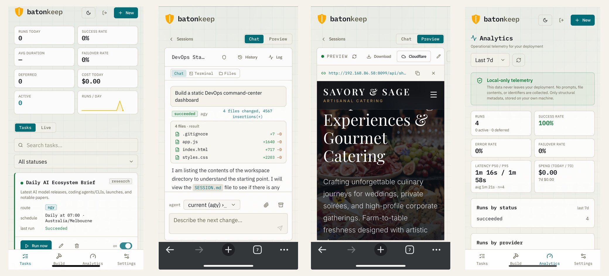

# batonkeep

[](https://github.com/batonkeep/batonkeep/actions/workflows/ci.yml)
[](LICENSE)
[](https://github.com/batonkeep/batonkeep/discussions)
[](https://batonkeep.com)
[](https://batonkeep.com/docs)

**Your plans, your keys, your machine.**
**Switch agents mid-task, keep the work.**

[**Website**](https://batonkeep.com) · [**Documentation**](https://batonkeep.com/docs) · [**Self-hosting guide**](https://batonkeep.com/docs/self-hosting)

<p align="center">
  
</p>

batonkeep is the device-independent control plane for your own subscription-backed AI
agents. Schedule tasks, run interactive build sessions, switch providers mid-task when
rate-limited, and publish work to shareable URLs — all on a backend you control.

## What it does

- **Task scheduler** — run prompts against your own Claude / Grok / Antigravity / Codex
  plans or API keys on a cron/interval schedule.
- **Capacity routing + failover** — when one plan is rate-limited, work fails over to the
  next. You configure the candidate order; the router handles the rest.
- **Build sessions** — interactive agent sessions with live preview and one-click artifact
  publishing to a shareable URL.
- **Sovereignty** — your subscription credentials never leave the machine running this
  backend. No third-party service holds your tokens.
- **Device-independent PWA** — the frontend is installable; the phone is a first-class client.

> **Two provider lanes — different capability.** Plan-backed providers run through each
> vendor's own agent CLI, so they get the full agentic experience: native tool use,
> multimodal input, and the richest behavior. API-key providers — including self-hosted or
> open-weight models behind an OpenAI-compatible endpoint — connect through a standard API
> path with **more limited agentic support**. You can mix both; expect the CLI/plan lane to
> be the more capable one.

## Stack

Python 3.12 · FastAPI · SQLAlchemy 2 async + aiosqlite · APScheduler ·
`openai` + `anthropic` SDKs · React + Vite + TypeScript + Tailwind · Docker Compose

## Quickstart (run the released images)

No build required — pull the prebuilt images from GHCR:

```bash
curl -fsSLO https://raw.githubusercontent.com/batonkeep/batonkeep/main/docker-compose.yml
curl -fsSL  https://raw.githubusercontent.com/batonkeep/batonkeep/main/.env.example -o .env
curl -fsSLO https://raw.githubusercontent.com/batonkeep/batonkeep/main/searxng-settings.yml
```

> Grab all three: the compose file bind-mounts `searxng-settings.yml` to power the built-in
> SearXNG web-search backend (it runs by default). Omit it and the `searxng` container won't
> start cleanly — or remove that service to fall back to a DuckDuckGo scrape.

Before starting, set two values in `.env`:

- **`APP_SECRET`** (required) — encrypts your stored credentials at rest. Generate one with
  `python -c "import secrets; print(secrets.token_hex(32))"`.
- **`APP_PASSWORD`** (strongly recommended) — gates the whole app behind a login, protecting
  your data and UI. **If it's empty there is no auth gate — anyone who can reach the web port
  has full access.** Always set it on a public host or VPS.

```bash
docker compose up -d                                  # dashboard at http://localhost:8080
```

Then log in to your subscription-plan CLIs (one time; auth persists on a volume):

```bash
docker compose exec -u sandbox -e HOME=/home/agent backend bash /app/scripts/auth.sh
```

Or, once you're signed in, re-auth a plan from the app — **Settings → AI Plans** runs the
same login flow in-browser when the scoped console is enabled (`ENABLE_WEB_CONSOLE=true`).

A single port (the frontend) is exposed; it reverse-proxies the API and WebSocket to the
backend over the internal network. To put it behind a public domain with TLS, point your
own reverse proxy or a **cloudflared** tunnel at that one port — see
[`docs/self-hosting.md`](docs/self-hosting.md) for the tunnel recipe, host requirements, and
the upgrade path.

### Run from source (contributors)

Clone the repo and `make up` — `docker-compose.override.yml` builds the images locally
instead of pulling. `make auth` runs the guided login. `make test` runs the backend suite.

## License

Copyright © 2026 BLAZE LABS PTY LTD. batonkeep is licensed under the **AGPLv3** — see
`LICENSE`. Enterprise/commercial licensing available — open an issue.

## Contributing

See `CONTRIBUTING.md`. All contributions require a DCO sign-off (`git commit -s`).
